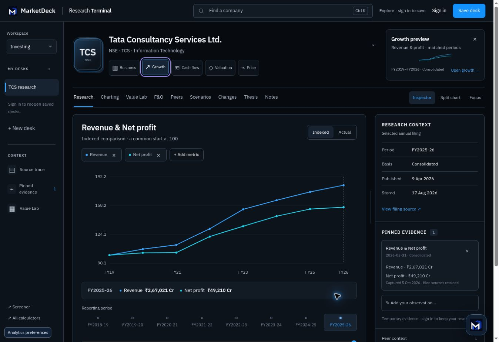

# Premium Research Terminal release verification

Verified on 4 October 2026 UTC. Production: https://marketdeck.in/screener/research-desk/?company=TCS.NS

The release keeps the existing nine views, authentication, private desk endpoints, filing data and calculation modules. The company navigator is the only tilting element; charts remain flat. Lens previews have their own reserved space, keyboard focus opens them, and Escape dismisses them. The metric picker opens from chart chips. The selected filing context and evidence share one inspector.

## Automated checks

- Production and review builds passed; JavaScript syntax and diff checks passed.
- 12 focused filing-mixer and valuation tests passed, including gaps, basis changes, reverse valuation, enterprise/equity bridges and invalid inputs.
- 17 current Research Desk Django tests passed, including owner-only saves, CSRF, revision conflicts, authoritative baselines and persisted terminal state. Django system checks passed. An authenticated template render also returned 200.
- The full web suite passed 107/109. The analytics dependency allowlist and product-art preview-attribute failures were also reproduced on the unchanged baseline (100/102), so this release introduced no new failures there.

## Browser verification

All nine production panels opened: Research, Charting, Value Lab, F&O, Peers, Scenarios, Changes, Thesis and Notes. Company search switched from TCS to Infosys and updated the company identity and independent filing context. The existing unsaved-change guard remained effective.

The exact rendered anonymous template was served temporarily with public stored filing fixtures and the deployed assets to check responsive layouts. At requested widths 320, 390 and 820 px (content widths 305, 375 and 805 px after scrollbars), the document had no horizontal overflow. The phone SVG fits its container and shows the annual history without forced sideways panning. All nine phone views, metric dialog and navigation were checked. The 1,348 px desktop document also had no horizontal overflow. The temporary fixture pages were removed after verification.

Keyboard checks covered preview dismissal, the mobile menu, native dialogs, Focus/Escape and restoring the evidence inspector. Desktop preview height stayed 161 px before and after opening, with a 140 px reserved preview area. Tilt is clamped to three degrees and enabled only for fine pointers with hover; reduced motion disables it. Motion CSS and guards were inspected, but OS motion emulation and physical touch hardware were unavailable in the cloud browser.

Known calculation examples returned earnings value ₹2,000, firm value ₹75/share, equity value ₹100/share and dividend value ₹50/share. The embedded manual options calculator returned premium 2.5574 with Greeks and payoff output for spot/strike 100, 30 days, volatility 20%, risk-free rate 6.5% and zero dividend yield. Charting and historical-chain embeds retained their visible dates and sources, and loaded the new opt-in presentation CSS. Charting's optional Screener fundamentals block reported its existing HTTP 403 honestly rather than filling in values.

Source and EPS dialogs retained the filing period, basis, published/stored dates and exact trace names. Pinning preserved those values. Anonymous notes stayed gated behind the existing sign-in flow; authenticated private persistence was verified by the backend tests, not by a production account browser session.

## Release

- Assets: marketdeck-web PRs #78 and #79; both existing deploy workflows completed successfully.
- Template: stockproof PR #66, merge `d934928070b01819d3e1859dd71843d4aac375b7`; existing Deploy workflow run `37233817131` completed successfully.
- No VPS configuration, infrastructure, authentication, data processing, paid services or LLM services were changed.

The screenshot below is the live production interface with one temporary anonymous evidence pin, not a design mockup.

