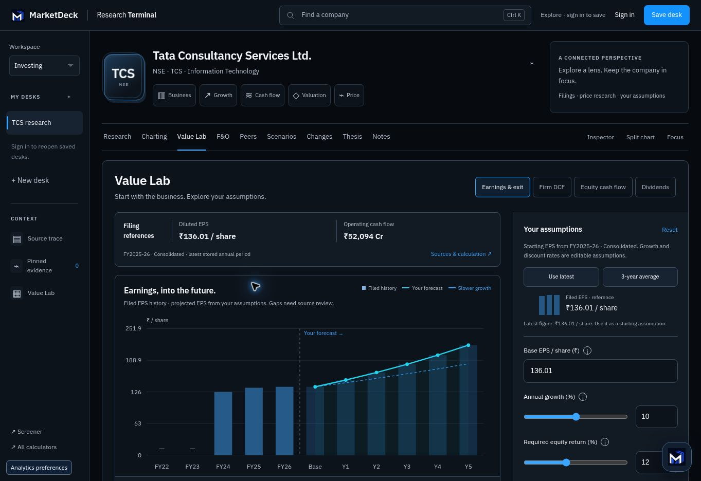

# Live Value Lab verification — 5 October 2026

Verified at https://marketdeck.in/screener/research-desk/?company=TCS.NS
by opening Value Lab in the deployed Research Terminal.

The live page loads `research-terminal-premium.js?v=20261005-value2`.
Its latest TCS annual reference is FY2025-26, consolidated, published
9 April 2026 and stored 17 August 2026. The EPS starting figure is ₹136.01
per share; operating cash flow is separately labelled ₹52,094 crore.

Verified live:

- Latest and three-year EPS references with their exact source periods/dates.
- Changing growth/discount inputs updates the forecast and valuation.
- FCFF helper fills supported EBIT/D&A references and leaves tax/reinvestment
  assumptions incomplete. Independently entered components produce ₹100 crore
  FCFF; a 10-crore share count, ₹50-crore cash and ₹300-crore debt produce
  ₹75/share at zero growth and 10% WACC, with ₹60 after a 20% safety margin.
- Keeping a case overlays its forecast and displays both scenario outcomes.
- Older zero EPS/positive-profit periods show "Needs verification", with their
  raw stored values available in source context. They are gaps in the chart.
- No application errors were observed from MarketDeck page scripts. Browser
  extension metadata errors are outside the application.

The screenshot below shows the actual deployed page. The "Slower growth" case
was entered for demonstration (6% growth vs the current 10% growth assumption),
not supplied by a data provider, and was not saved to a user account.

Final release workflows succeeded:

- Web: [37258815238](https://github.com/sarthakk-1126/marketdeck-web/actions/runs/37258815238), commit `53eb0566d15a60e273a334ead9e144cf94685d2b`.
- Stockproof: [37258894464](https://github.com/sarthakk-1126/stockproof/actions/runs/37258894464), commit `628473af499f17cbb7f98520e8c51780271e4ffa`.

The isolated calculation suite passed 19/19; desk/reference backend checks
passed 22/22. Desktop/mobile, reduced motion, all nine views and private save
roundtrips passed in the browser suites. Full-suite pre-existing homepage/art
failures and the resolved generated-cache deployment blocker are documented in
[the QA report](value-lab-20261005.md).
